# Лабораторная работа 5  
## Toolkit, Postman, Vue Introduction

В данной лабораторной работе были выполнены задания по работе с библиотеками **PixiJS**, **Axios** и инструментом **Postman**.

---

## Содержание

- [Задание 1.  PixiJS](#задание-1-анимация-в-pixijs)
- [Задание 2. GET-запрос к VK через Axios](#задание-2-get-запрос-к-vk-через-axios)
- [Задание 3. GET-запрос к geoiplookup через Axios](#задание-3-get-запрос-к-geoiplookup-через-axios)
- [Задание 4. Установка Postman](#задание-4-установка-postman)
- [Задание 5. GET-запросы в Postman](#задание-5-get-запросы-в-postman)
- [Задание 6. POST register в Postman](#задание-6-post-register-в-postman)
- [Задание 7. POST login в Postman](#задание-7-post-login-в-postman)
- [Вывод](#вывод)

---

## Задание 1. Анимация в PixiJS

**PixiJS** была создана  анимация вращения прямоугольника.

- библиотека `pixi.js`;
- добавлен прямоугольник;
- в анимационном цикле изменялось свойство `rotation`.

### Результат

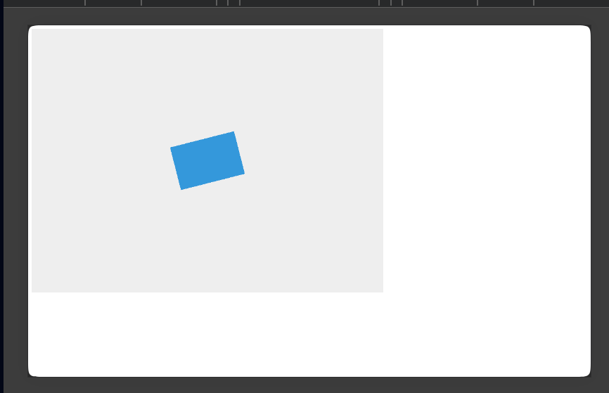

### Вывод

Был получен вращающийся прямоугольник.

---

## Задание 2. GET-запрос к VK через Axios

Был выполнен GET-запрос к адресу:

```text
https://vk.com
```

Запрос запускался в браузере и в Node.js.

### Результат в браузере

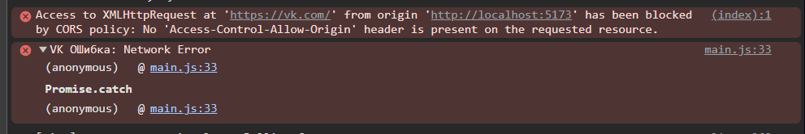

### Объяснение

В браузере запрос к `https://vk.com` был заблокирован политикой **CORS**. Причина в том, что сервер не вернул заголовок `Access-Control-Allow-Origin`.

Браузер разрешает JavaScript читать ответы от другого origin только в том случае, если сервер явно это разрешил. Поэтому в консоли появилась ошибка CORS.

### Результат в Node.js

При выполнении того же запроса в Node.js ответ был получен успешно. Сервер вернул HTML-код страницы VK.

### Вывод

- в браузере запрос блокируется из-за CORS;
- в Node.js запрос выполняется успешно, так как Node.js не применяет ограничения браузерной политики безопасности.

---

## Задание 3. GET-запрос к geoiplookup через Axios

Был выполнен GET-запрос к API:

```text
https://json.geoiplookup.io/
```

### Результат

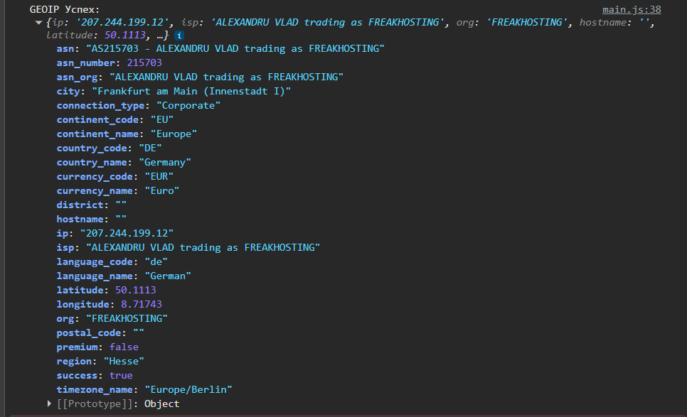

### Что получилось

В ответ был получен JSON-объект с информацией об IP-адресе, провайдере, организации, стране, городе и координатах.

### Объяснение

В отличие от `vk.com`, сервис `geoiplookup.io` работает как API и возвращает JSON-ответ. Запрос в браузере выполнился успешно, так как сервер допускает такой доступ.

---

## Задание 4. Установка Postman

установлен **Postman**.


Postman умеет:

- отправлять HTTP-запросы;
- просматривать тело ответа;
- анализировать заголовки;
- тестировать API без ограничений браузера.

---

## Задание 5. GET-запросы в Postman

В Postman были отправлены GET-запросы к следующим ресурсам:

```text
https://vk.com
https://json.geoiplookup.io/
```

### Запрос к VK

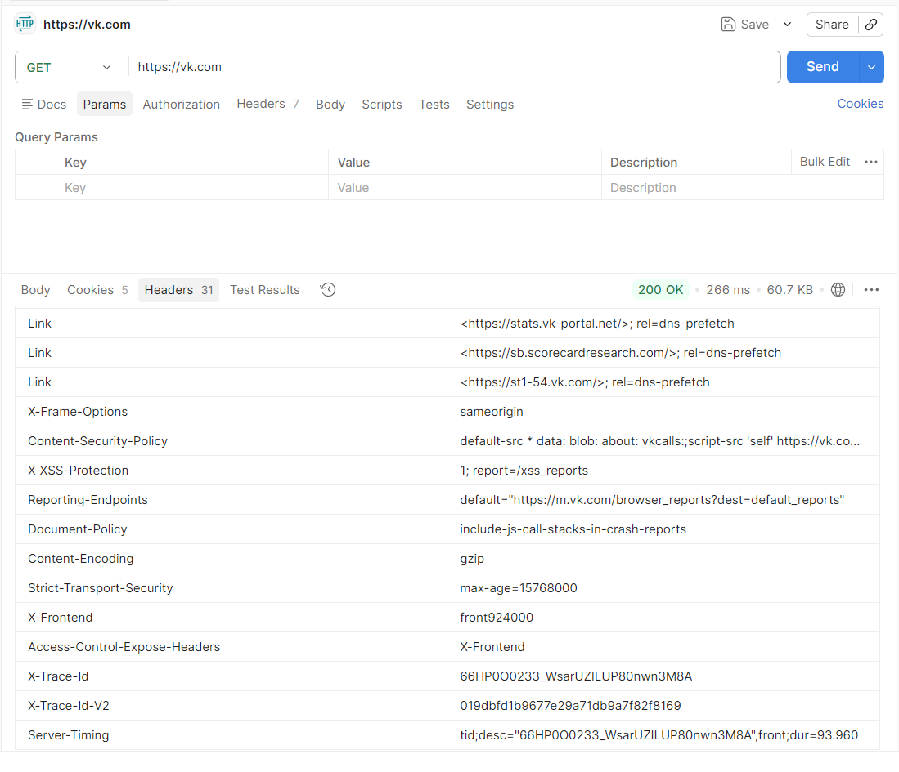

### Запрос к geoiplookup

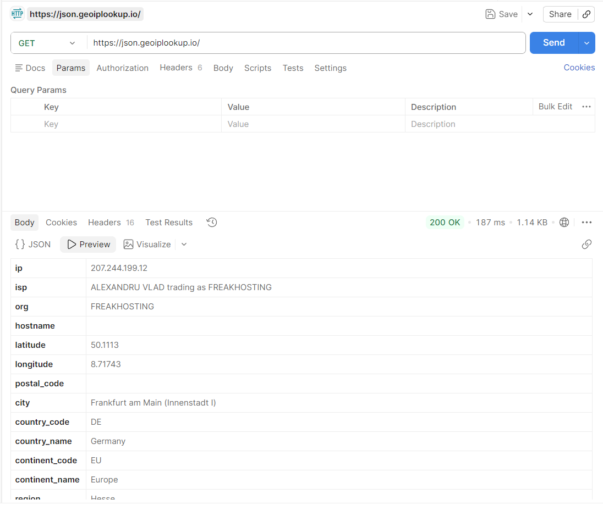

### Анализ заголовков ответа

#### Для `https://vk.com`

- статус ответа: `200 OK`;
- `Content-Type: text/html` - сервер вернул HTML-страницу;
- присутствуют заголовки безопасности;
- присутствуют служебные заголовки и cookies.

#### Для `https://json.geoiplookup.io/`

- статус ответа: `200 OK`;
- сервер вернул JSON-ответ;
- содержатся данные об IP и геолокации;
- запрос успешно выполняется как обычный API-запрос.

### Вывод

Postman не ограничен политикой CORS, поэтому оба запроса выполняются корректно - позволяет анализировать реальные ответы сервера и их заголовки.

---

## Задание 6. POST register в Postman

Был выполнен POST-запрос к fake API:

```text
https://reqres.in/api/register
```

данные передавались в формате `x-www-form-urlencoded` с полями `email` и `password`.

### Получение списка пользователей

Перед выполнением регистрации был сделан GET-запрос:

```text
https://reqres.in/api/users
```

чтобы получить email заготовленного пользователя.

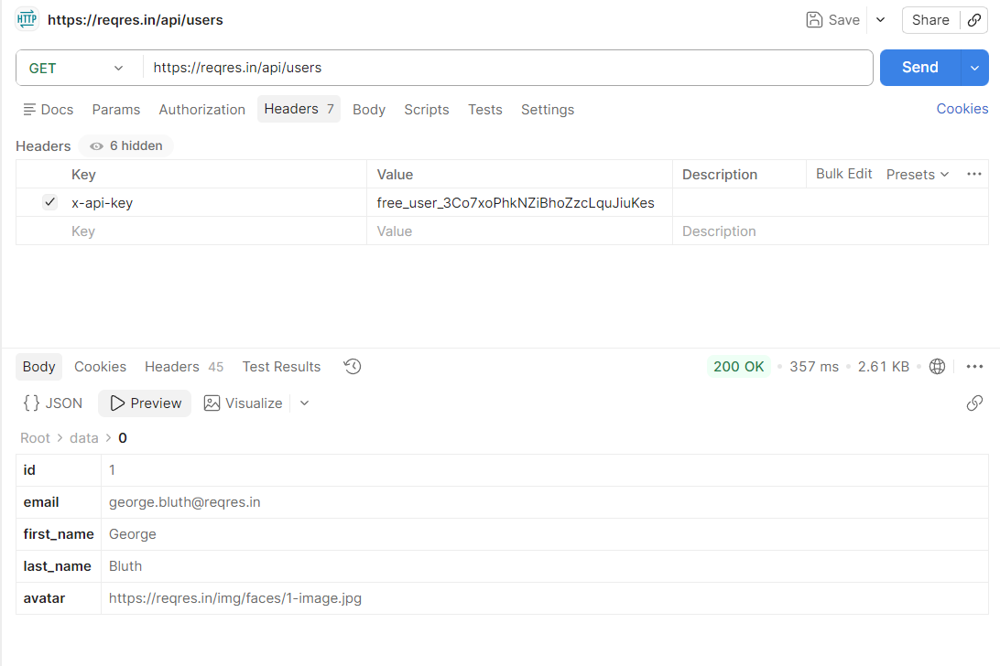

### Выполнение register-запроса

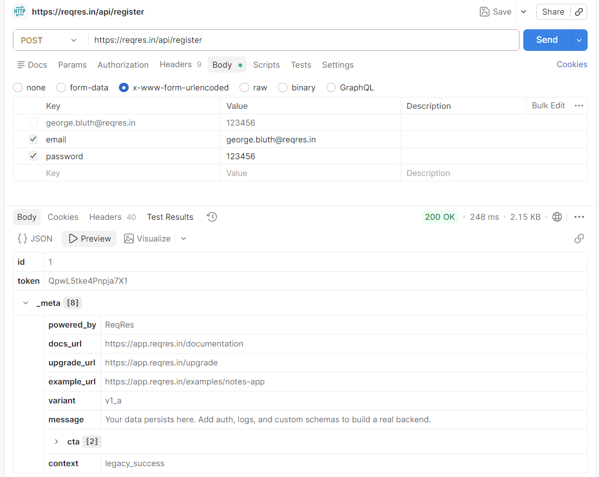

### Что было сделано

- выбран метод `POST`;
- указан адрес `/api/register`;
- в `Body` выбран формат `x-www-form-urlencoded`;
- переданы поля `email` и `password`.

### Результат

Сервер вернул успешный ответ с полями:

- `id`;
- `token`.


---

## Задание 7. POST login в Postman

Был выполнен POST-запрос к адресу:

```text
https://reqres.in/api/login
```

На этот раз данные отправлялись в виде **JSON-объекта** с полями `email` и `password`.

### Результат

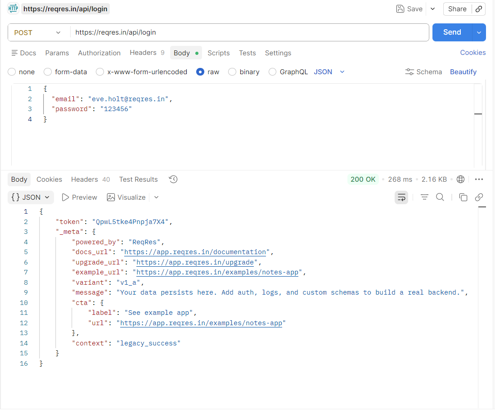

### Что было сделано

- выбран метод `POST`;
- указан адрес `/api/login`;
- в `Body` выбран режим `raw`;
- тип содержимого установлен как `JSON`;
- отправлен объект следующего вида:

```json
{
  "email": "eve.holt@reqres.in",
  "password": "123456"
}
```

### Результат

Сервер вернул `token`, что означает успешный вход в систему.

---

---

# Часть 2. Лабораторная работа 5 — Vue Introduction

подключение Vue через тег `script`, создание реактивного кликера, инициализация проекта через `npm init vue@latest`, работа с Composition API, Single File Components, props, slots и пользовательскими событиями.

## Задание 1-2. HTML-файл с Vue и реактивный кликер [part2/index.html]

`html`-файл, в который Vue был подключён через тег `script`.На странице реализован  кликер со счётчиком и кнопкой, изменение отображалось на странице реактивно.


---

## Задание 3. Создание Vue-проекта

Далее был создан полноценный Vue-проект с помощью утилиты:

```bash
npm init vue@latest
```

После установки зависимостей проект был запущен через dev-сервер.

### Результат
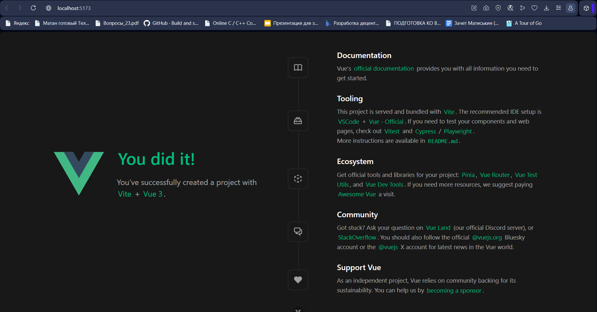

---

## Задание 4. Кликер в проекте с Composition API и Single File Components [vue-project]

В созданном проекте был реализован тот же кликер, но уже во Vue-приложении с использованием **Composition API** и **Single File Components**. Для этого использовался файл `App.vue`, в котором состояние счётчика было объявлено через `ref`.

### Что было сделано
- в `App.vue` создан реактивный счётчик;
- реализована функция увеличения;
- интерфейс оформлен в одном `.vue`-файле.

### Результат
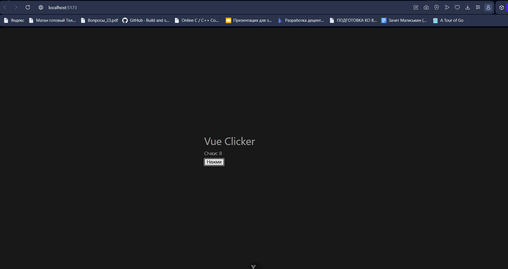
---

## Задание 5–6. Компонент `<Clicker />`, 100 экземпляров и prop `amount`

Созданный кликер был вынесен в отдельный компонент `<Clicker />`. Затем на страницу было выведено 100 таких кликеров с помощью `v-for`. Каждый экземпляр работал независимо от остальных, так как внутри каждого компонента использовалось собственное реактивное состояние. Был реализован prop `amount`, который определяет, сколько очков прибавляется за один клик.


### Результат
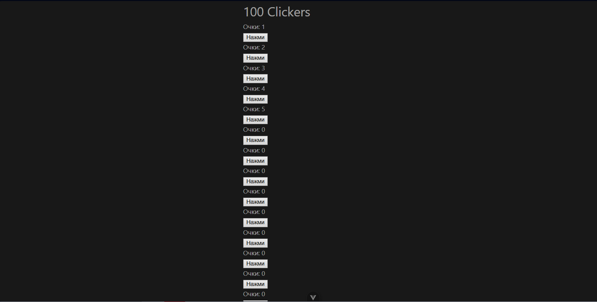

---

## Задание 7–8. Кастомная кнопка через slot и событие `button-clicked`

Для компонента `<Clicker />` - возможность передавать кнопку из родительского компонента через slot. Содержимое между тегами `<Clicker>` и `</Clicker>` кликабельным элементом управления. Также было добавлено пользовательское событие `button-clicked`, которое генерируется при каждом клике и может обрабатываться родительским компонентом.

### Что было сделано
- в компоненте `Clicker.vue` добавлен `<slot>`;
- кнопка стала настраиваемой из `App.vue`;
- добавлено пользовательское событие `button-clicked`;
- в родительском компоненте реализован обработчик этого события.

### Результат
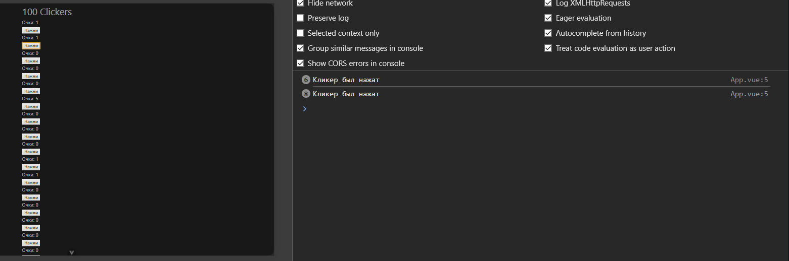

---

## Задание 9. Обработчик для каждого из 100 кликеров

Для каждого из 100 кликеров был назначен собственный обработчик события `button-clicked`. При нажатии на кнопку - окно `alert` с текстом:

```text
Clicker <n> clicked!
```

где `<n>` - номер конкретного кликера от 1 до 100.

### Что было сделано
- в `App.vue` каждому компоненту `<Clicker />` был передан обработчик;
- в обработчик - номер текущего кликера;
- при клике выводилось соответствующее сообщение через `alert`.

### Результат
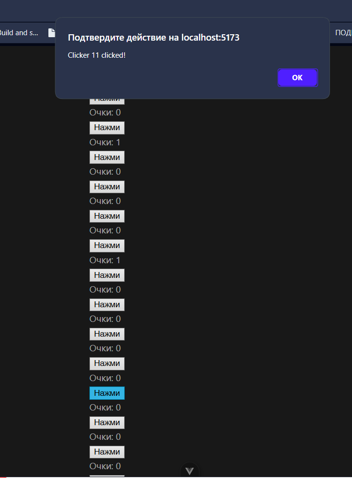


---


